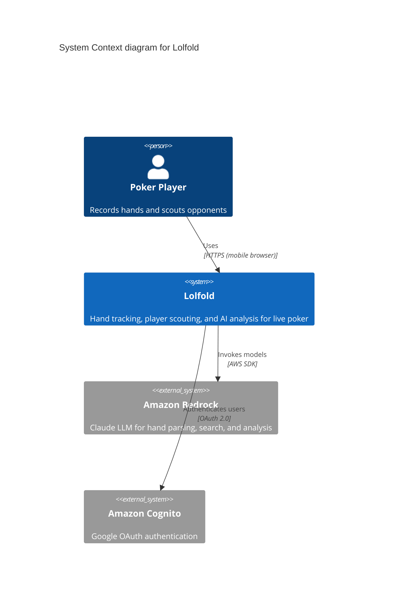
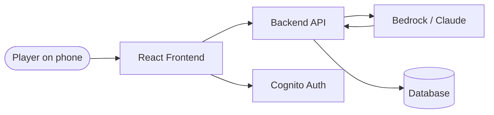

# Lolfold

## Title
Lolfold — Live Poker Hand Tracking System

## Description
Lolfold is a web-based system for live poker players to record, organize, and analyze hand histories. Players input hands using shorthand notation on their phones at the table. AI (Claude via Amazon Bedrock) parses these into structured records. The system tracks players across hands, supports freeform scouting notes, provides traditional and AI-powered search, and includes a visual hand replayer.

The system is designed for small groups of friends who play live poker regularly and want to share intelligence on their local player pool.

## Tech Stack

- **Frontend**: React (Vite), TypeScript
- **Backend**: TBD (Node.js/Express or Python/FastAPI)
- **Database**: TBD (DynamoDB or PostgreSQL)
- **AI**: Amazon Bedrock (Claude) — hand parsing, NL search, player analysis
- **Auth**: Amazon Cognito (Google OAuth)
- **Infrastructure**: Terraform, AWS (us-west-2)
- **Hosting**: TBD (S3+CloudFront for frontend, ECS or Lambda for API)

## Integrations

### External Systems
- Amazon Bedrock — AI model invocation for hand parsing, search, and analysis
- Google OAuth (via Cognito) — user authentication

## Containers

- [00-01-frontend.md](./00-01-frontend.md) - React web app (mobile-first)
- [00-02-api.md](./00-02-api.md) - Backend API service
- [00-03-database.md](./00-03-database.md) - Data storage
- [00-04-ai.md](./00-04-ai.md) - Bedrock/Claude AI integration layer

## Quality Attributes

- **Performance**: Hand parsing < 3s, UI interactions < 200ms
- **Security**: No public ingress (VPC CIDR + personal IP only), encryption at rest
- **Availability**: POC-grade — single region, no HA requirements
- **Scalability**: Small user base (< 10 users), doesn't need to scale for POC

## Related Items

- [Product Brief](../project/product-brief.md)
- [Core PRD](../requirements/prd-core.md)

## Diagrams

### C4 System Context Diagram

### High-Level Data Flow

