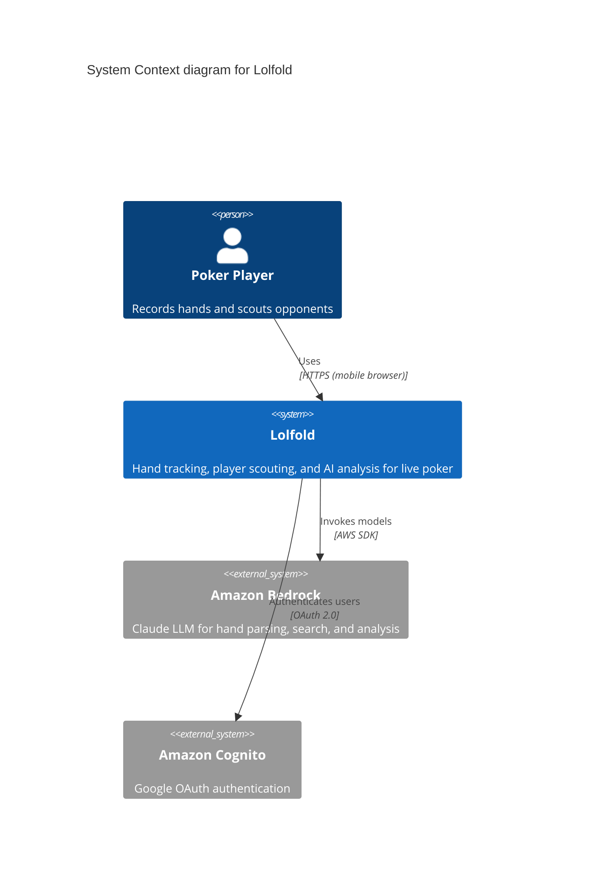
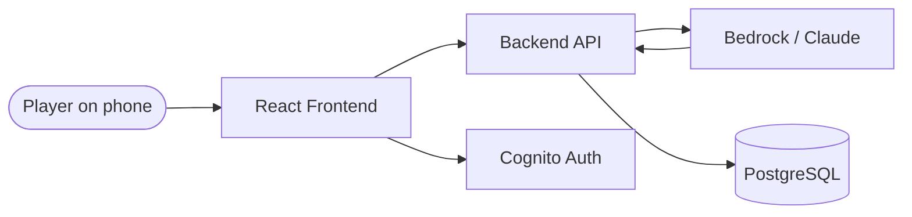

# Lolfold

## Title
Lolfold — Live Poker Hand Tracking System

## Description
Lolfold is a web-based system for live poker players to record, organize, and analyze hand histories. Players input hands using shorthand notation on their phones at the table. AI (Claude via Amazon Bedrock) parses these into structured records. The system tracks players across hands, supports freeform scouting notes, provides traditional and AI-powered search, and includes a visual hand replayer.

The system is designed for small groups of friends who play live poker regularly and want to share intelligence on their local player pool.

## Tech Stack

- **Frontend**: React 19 (Vite), TypeScript, Tailwind CSS v4
- **Backend**: Node.js 20 + Express + TypeScript + Prisma ORM
- **Database**: PostgreSQL 17.4 (RDS)
- **AI**: Amazon Bedrock (Claude) — hand parsing, NL search, player analysis
- **Auth**: Amazon Cognito (Google OAuth) — not yet implemented
- **Infrastructure**: Terraform, AWS (us-west-2)
- **Hosting**: S3+CloudFront (frontend), ECS Fargate (API)

## Integrations

### External Systems
- Amazon Bedrock — AI model invocation for hand parsing, search, and analysis
- Google OAuth (via Cognito) — user authentication (planned)

## Containers

| Container | Description | Repo |
|-----------|-------------|------|
| Frontend | React web app (mobile-first) | lolfold-frontend |
| API | Backend API service (Express) | lolfold-api |
| Database | PostgreSQL 17.4 (RDS) | lolfold-infra |
| AI Layer | Bedrock/Claude integration | lolfold-api |

## Quality Attributes

- **Performance**: Hand parsing < 3s, UI interactions < 200ms
- **Security**: No public ingress (VPC CIDR + personal IP only), encryption at rest
- **Availability**: POC-grade — single region, no HA requirements
- **Scalability**: Small user base (< 10 users), doesn't need to scale for POC

## Current State (as of POC completion)

All core features built and deployed. Known blocking issue: Bedrock region routing causes 502 on all AI features (hand parsing, AI search, player summaries). Root cause is SDK routing inference profile `us.anthropic.claude-sonnet-4-6` to us-east-1 instead of us-west-2. Fix: switch to foundation model ID.

Authentication not yet implemented — access restricted by security groups (VPC + operator IP).

## Live URLs

- **Frontend**: https://d1uw756ov4qd1d.cloudfront.net
- **API**: https://d1uw756ov4qd1d.cloudfront.net/api/*

## Diagrams

### C4 System Context Diagram

### High-Level Data Flow

