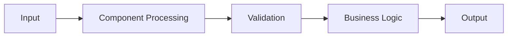
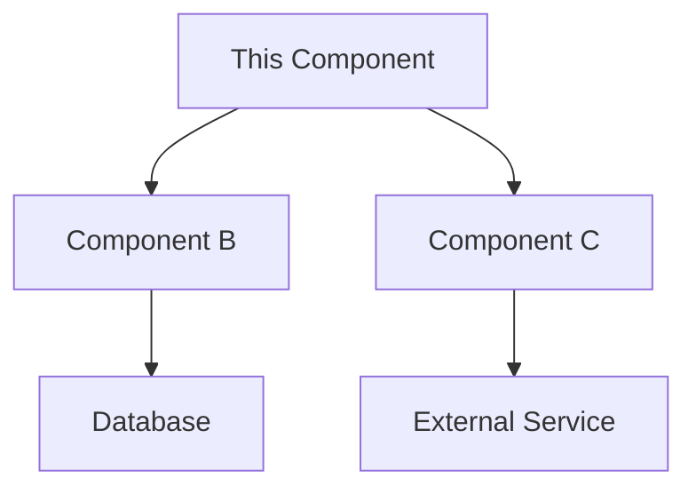
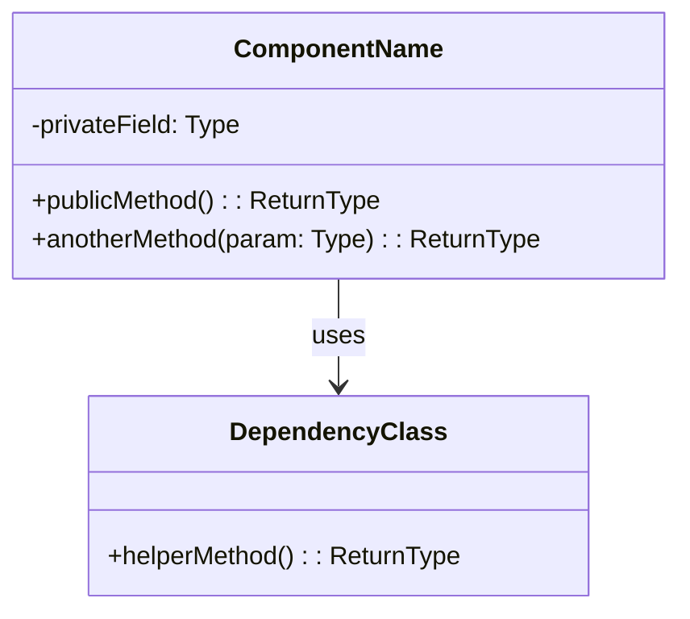
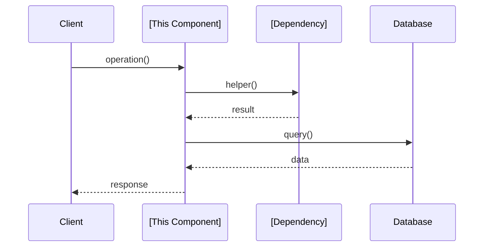

# [Component Name]

<!--
C4 Level 3: Component
Filename convention: 00-01-01-component-name.md
(where 00 = system, 01 = container, 01 = this component)
A component is a grouping of related functionality within a container.
-->

## Title

<!-- e.g., "Authentication Component" -->
[Component Name]

## Description

<!--
Describe this component's purpose and responsibilities within the parent container.
What does this component do? Why does it exist as a separate component?
-->

[1-2 paragraphs describing the component's purpose and role]

## Tech Stack

<!--
List technologies specific to this component
-->

- **Language/Framework:** [Primary technologies]
- **Key Libraries:** [Important dependencies]
- **Patterns:** [Design patterns used: MVC, Repository, Factory, etc.]

## Responsibilities

<!--
What are this component's specific responsibilities?
-->

1. **[Responsibility 1]**: [Description]
2. **[Responsibility 2]**: [Description]
3. **[Responsibility 3]**: [Description]

## Interfaces

<!--
What interfaces does this component expose?
How do other components interact with it?
-->

### Public Interface

```typescript
// Example: TypeScript interface definition
interface ComponentName {
  method1(param: Type): ReturnType;
  method2(param: Type): Promise<ReturnType>;
}
```

Or describe in prose:
- **[Method/Function 1]**: [Purpose, inputs, outputs]
- **[Method/Function 2]**: [Purpose, inputs, outputs]

## Dependencies

<!--
What does this component depend on?
List other components, libraries, external services.
-->

### Internal Dependencies (within container)
- [Other Component A](./00-01-02-component-a.md) - [What it provides]
- [Other Component B](./00-01-03-component-b.md) - [What it provides]

### External Dependencies
- [Library/Package]: [Version, purpose]
- [External Service]: [What we use it for]

## Data Flow

<!--
How does data flow through this component?
-->



Or describe in prose:
1. [Step 1 of data processing]
2. [Step 2 of data processing]
3. [Step 3 of data processing]

## Key Classes/Modules

<!--
If drilling down to code level, list important classes or modules
-->

### [Class/Module 1]
- **Purpose**: [What it does]
- **Location**: `src/path/to/file.ts`
- **Key Methods**: [List important methods]

### [Class/Module 2]
- **Purpose**: [What it does]
- **Location**: `src/path/to/file.ts`
- **Key Methods**: [List important methods]

## Error Handling

<!--
How does this component handle errors?
-->

- **[Error Type 1]**: [How it's handled]
- **[Error Type 2]**: [How it's handled]
- **Logging**: [How errors are logged]
- **Recovery**: [Recovery strategies]

## Testing Strategy

<!--
How is this component tested?
-->

- **Unit Tests**: [Coverage, approach]
- **Integration Tests**: [What's tested]
- **Test Location**: `tests/path/to/tests/`
- **Mocking Strategy**: [How dependencies are mocked]

## Performance Considerations

<!--
Any performance-related notes for this component
-->

- **Bottlenecks**: [Known or potential bottlenecks]
- **Optimizations**: [Performance optimizations in place]
- **Caching**: [Caching strategies if applicable]
- **Resource Usage**: [Memory, CPU considerations]

## Security Considerations

<!--
Security aspects specific to this component
-->

- **Input Validation**: [How inputs are validated]
- **Authorization**: [Access control mechanisms]
- **Sensitive Data**: [How sensitive data is handled]
- **Vulnerabilities**: [Known security considerations]

## Configuration

<!--
Configuration specific to this component
-->

- `CONFIG_PARAM_1`: [Description, default]
- `CONFIG_PARAM_2`: [Description, default]

## Related Items

<!--
Link to related context files
-->

- [Parent Container](./00-01-container-name.md)
- [Parent System](./00-system-name.md)
- [Related Spec](../specs/feature/01-feature/01-feature.spec.md)
- [Code Documentation](link-to-code-docs)

## Diagrams

### Component Interaction



### Class Diagram

<!--
Optional: If drilling down to code structure
-->



### Sequence Diagram

<!--
Optional: Show interaction flow for key operations
-->



---

## Notes

<!--
Implementation details, design decisions, gotchas, TODOs
-->

[Additional notes, decisions, or context]

## Code Examples

<!--
Optional: Show example usage or implementation snippets
-->

```typescript
// Example usage
const component = new ComponentName(dependencies);
const result = await component.method1(input);
```
