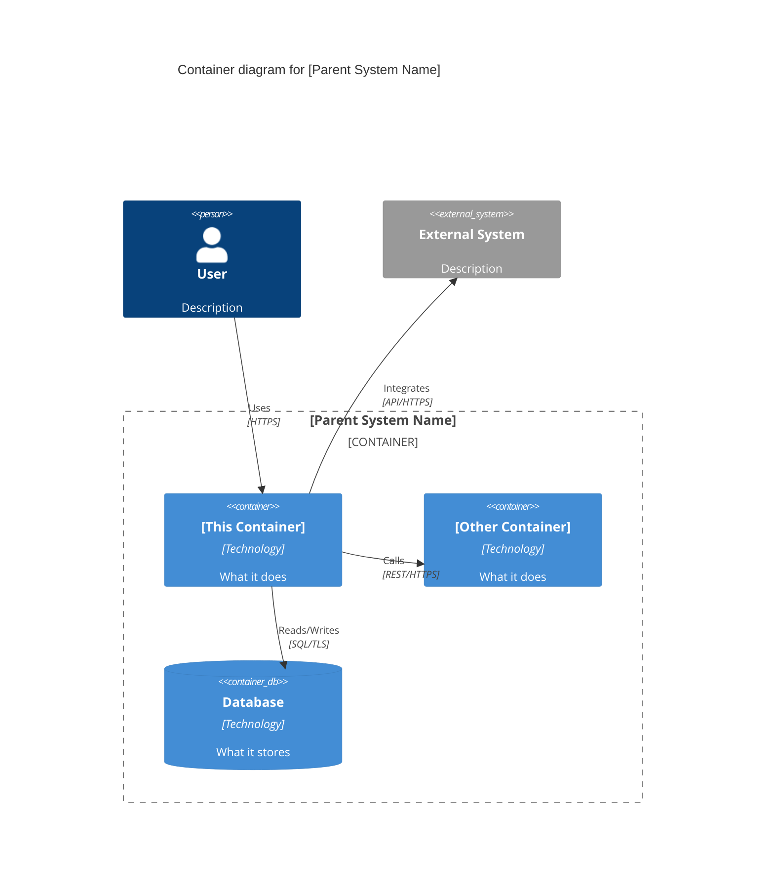
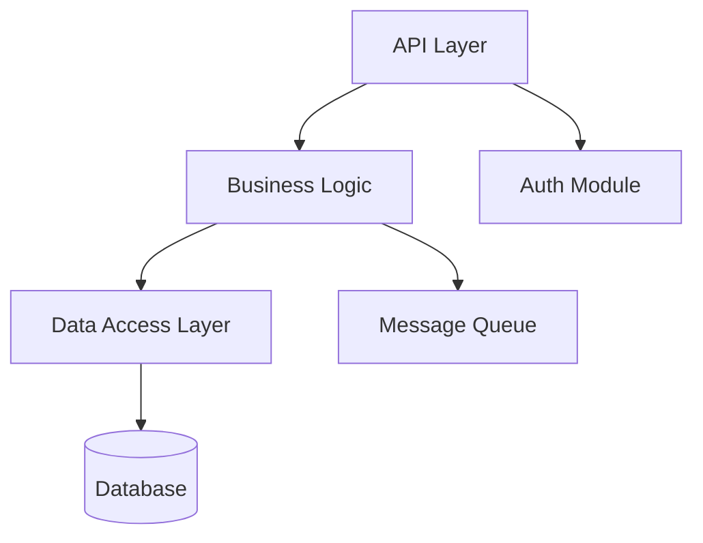
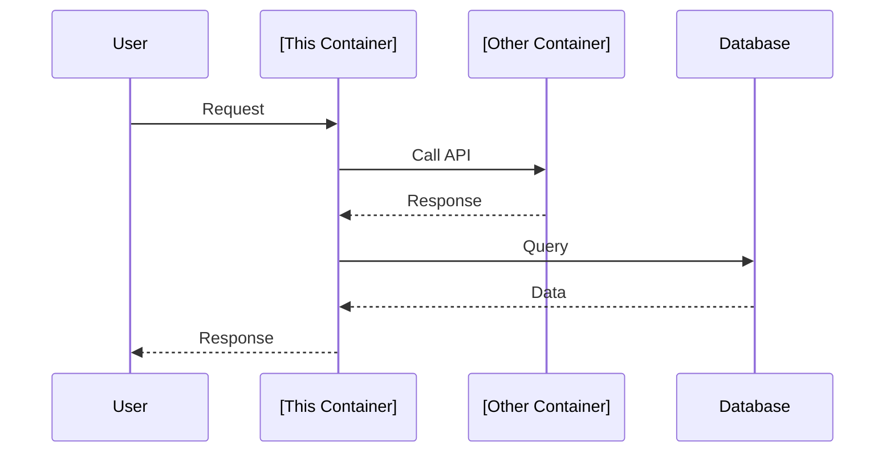

# [Container Name]

<!--
C4 Level 2: Container
Filename convention: 00-01-container-name.md (where 00 = parent system, 01 = this container)
A container is an application, service, data store, or similar deployable/runnable unit.
-->

## Title

<!-- e.g., "API Gateway Container" -->
[Container Name]

## Description

<!--
Describe this container's purpose, responsibilities, and role within the parent system.
What does this container do? What problems does it solve?
-->

[2-3 paragraphs describing the container's purpose and key responsibilities]

## Tech Stack

<!--
List the technologies specifically used by this container.
-->

- **Language/Runtime:** [e.g., Node.js, Python, Java]
- **Framework:** [e.g., Express, FastAPI, Spring Boot]
- **Database:** [If this container owns a database]
- **APIs:** [API style: REST, GraphQL, gRPC]
- **Key Libraries:** [Important dependencies]
- **Testing:** [Testing frameworks and tools]
- **Build/Deploy:** [Build tools, containerization]

## Responsibilities

<!--
What are this container's key responsibilities?
Keep this focused on WHAT it does, not HOW.
-->

1. **[Responsibility 1]**: [Description]
2. **[Responsibility 2]**: [Description]
3. **[Responsibility 3]**: [Description]

## Integrations

<!--
What does this container integrate with?
List both internal containers and external systems.
-->

### Internal (within parent system)
- [Container B](./00-02-container-b.md) - [How they communicate, protocol]
- [Container C](./00-03-container-c.md) - [How they communicate, protocol]

### External (outside parent system)
- [External System](../architecture/other-system.md) - [Protocol, purpose]
- [Third-party Service] - [API/integration details]

## Dependencies

<!--
What does this container depend on?
Include libraries, infrastructure, other containers, external services.
-->

- [Dependency 1]: [Version constraints, why it's needed]
- [Dependency 2]: [Version constraints, why it's needed]
- [Infrastructure requirement]: [What's needed]

## Components

<!--
If this container is complex, list its major internal components.
Link to component-level architecture files if they exist.
-->

- [00-01-01-component-name.md](./00-01-01-component-name.md) - [Brief description]
- [00-01-02-another-component.md](./00-01-02-another-component.md) - [Brief description]

## APIs and Interfaces

<!--
Document the APIs or interfaces this container exposes.
Link to contract files where available.
-->

### Exposed APIs
- **[Endpoint/Interface 1]**: [Purpose, protocol]
  - Contract: [Link to OpenAPI/schema file]
- **[Endpoint/Interface 2]**: [Purpose, protocol]
  - Contract: [Link to OpenAPI/schema file]

### Consumed APIs
- **[External API 1]**: [What we use it for]
- **[External API 2]**: [What we use it for]

## Data Model

<!--
Describe the data this container manages.
Include key entities, relationships, or link to schema files.
-->

### Key Entities
- **[Entity 1]**: [Description, key fields]
- **[Entity 2]**: [Description, key fields]

### Data Storage
- **Type**: [SQL, NoSQL, Cache, File storage, etc.]
- **Technology**: [PostgreSQL, MongoDB, Redis, S3, etc.]
- **Schema**: [Link to schema file if available]

## Configuration

<!--
Important configuration parameters or environment variables
-->

### Environment Variables
- `VAR_NAME`: [Description, default value]
- `ANOTHER_VAR`: [Description, default value]

### Configuration Files
- [config.yaml](path/to/config.yaml) - [Purpose]

## Deployment

<!--
How is this container deployed?
-->

- **Deployment Target**: [Kubernetes, ECS, Lambda, VM, etc.]
- **Scaling**: [Horizontal/vertical, auto-scaling strategy]
- **Health Checks**: [Health check endpoints or mechanisms]
- **Resource Requirements**: [CPU, memory, storage needs]

## Contracts

<!--
List contracts or schemas that define this container's interfaces
-->

- [API Contract](../contracts/container-api.yaml) - OpenAPI specification
- [Message Schema](../contracts/container-events.json) - Event schema
- [Database Schema](../contracts/container-db-schema.sql) - Database DDL

## Quality Attributes

<!--
Non-functional requirements specific to this container
-->

- **Performance**: [Response time targets, throughput]
- **Scalability**: [How it scales, limits]
- **Availability**: [Uptime requirements]
- **Security**: [Authentication, authorization, encryption]
- **Observability**: [Logging, metrics, tracing]

## Related Items

<!--
Link to related context files
-->

- [Parent System](./00-system-name.md)
- [Requirements](../requirements/relevant-prd.md)
- [Spec](../specs/feature/01-feature/01-feature.spec.md)
- [Tech Debt](../tech-debt/item.md)

## Diagrams

### C4 Container Diagram

### Component/Internal Structure

<!--
Optional: Show the internal structure of this container
-->

### Sequence Diagram

<!--
Optional: Show key interaction flows
-->

---

## Notes

<!--
Any additional context, design decisions, constraints, or important information
-->

[Additional notes]
