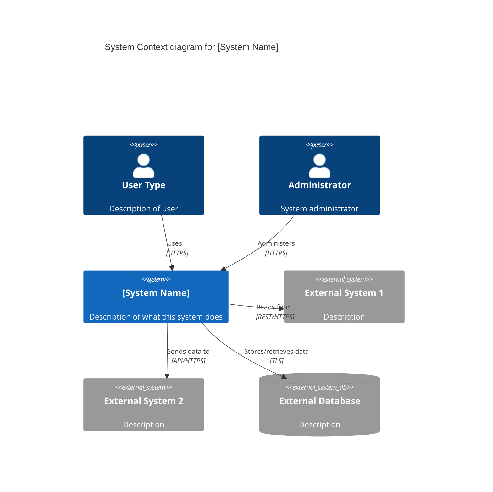
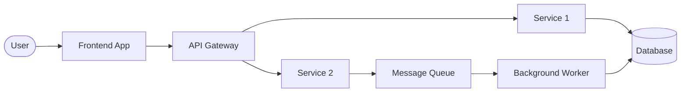

# [System Name]

<!--
C4 Level 1: System Context
Filename convention: 00-system-name.md
Replace this comment and the H1 with your system's actual name.
-->

## Title

<!-- e.g., "Customer Portal System" -->
[System Name]

## Description

<!--
Provide a concise technical and functional overview of the system.
What does this system do? Who uses it? What business value does it provide?
-->

[2-4 paragraphs describing the system's purpose, key capabilities, and role in the broader ecosystem]

## Tech Stack

<!--
List the primary technologies used across the system.
Group by layer or concern for clarity.
-->

- **Frontend:** [Technologies, frameworks, libraries]
- **Backend:** [Languages, frameworks, runtimes]
- **Database:** [Database systems]
- **APIs:** [API styles: REST, GraphQL, gRPC, etc.]
- **Infrastructure:** [Cloud platform, containerization, orchestration]
- **DevOps/Tooling:** [CI/CD, monitoring, logging tools]
- **Other:** [Any other significant technologies]

## Integrations

<!--
List systems this system integrates with.
Link to architecture files where available.
Distinguish between internal and external systems.
-->

### Internal Systems
- [System A](../architecture/00-system-a.md) - [Brief description of integration]
- [System B](../architecture/00-system-b.md) - [Brief description of integration]

### External Systems
- [External Service 1] - [Brief description of integration, protocol]
- [External Service 2] - [Brief description of integration, protocol]

## Dependencies

<!--
Key dependencies that this system relies on.
Can include other systems, libraries, services, infrastructure.
Link to container-level architecture files where applicable.
-->

- [Container A](../architecture/00-01-container-a.md) - [What it provides]
- [Container B](../architecture/00-02-container-b.md) - [What it provides]
- [Runtime/Platform] v[version]+ - [Why it's needed]
- [Major library/framework] - [Why it's needed]

## Containers

<!--
List the major containers (applications, services, data stores) within this system.
Link to their detailed architecture files.
-->

- [00-01-container-name.md](./00-01-container-name.md) - [Brief description]
- [00-02-another-container.md](./00-02-another-container.md) - [Brief description]
- [00-03-data-store.md](./00-03-data-store.md) - [Brief description]

## Contracts

<!--
List relevant contracts, schemas, or shared interfaces that define interactions.
-->

- [API Contract](../contracts/api-contract.yaml) - OpenAPI 3.0 specification
- [Event Schema](../contracts/events.json) - Event messaging schema
- [Shared Types](../contracts/shared-types.ts) - Shared TypeScript definitions

## Quality Attributes

<!--
Key non-functional requirements and architectural characteristics
-->

- **Performance:** [Performance targets, SLAs]
- **Scalability:** [Scalability requirements]
- **Security:** [Security requirements, compliance]
- **Availability:** [Uptime requirements, disaster recovery]
- **Maintainability:** [Code quality standards, technical standards]

## Related Items

<!--
Link to related context files: requirements, specs, plans, tech debt
-->

- [PRD: Feature Name](../requirements/prd-feature-name.md)
- [Project Brief](../project/product-brief.md)
- [Spec: Implementation](../specs/feature/01-feature-name/01-feature-name.spec.md)
- [Tech Debt: Item](../tech-debt/item.md)

## Diagrams

<!--
Add one or more diagrams to visualize the architecture.
Use Mermaid syntax. Include multiple diagram types as needed.
-->

### C4 System Context Diagram

### High-Level Data Flow

<!--
Optional: Add other diagram types as needed (sequence, ERD, flowchart, etc.)
-->

### Additional Diagrams

<!--
Add sequence diagrams, ERDs, component diagrams, or other visualizations as needed
-->

---

## Notes

<!--
Any additional context, design decisions, constraints, or important information
-->

[Additional notes or context]
